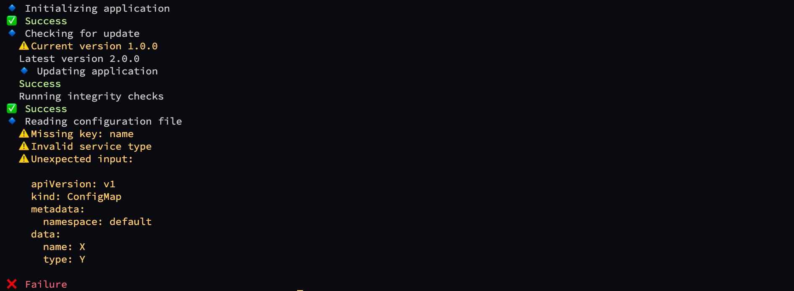

# go-cli-printer

[](https://github.com/anton-yurchenko/go-cli-printer/releases/latest)
[](https://goreportcard.com/report/github.com/anton-yurchenko/go-cli-printer)
[](LICENSE.md)

Simple and Pretty output library for CLI applications

## Manual

### Install

`go get -u github.com/anton-yurchenko/go-cli-printer`

### Example



```golang
package main

import (
    printer "github.com/anton-yurchenko/go-cli-printer"
)

func main() {
    p := printer.Printer{}

    p.PrintWithBullet(printer.Action, "Initializing application")
    p.SuccessWithBullet()

    p.PrintWithBullet(printer.Action, "Checking for update")
    p.Indent().WarningWithBullet("Current version 1.0.0")
    p.Print("Latest version 2.0.0")
    p.PrintWithBullet(printer.Action, "Updating application")
    p.Success()
    p.Print("Running integrity checks")
    p.Outdent().SuccessWithBullet()

    p.PrintWithBullet(printer.Action, "Reading configuration file")
    p.Indent().ListOfWarningsWithBullets([]string{"Missing key: name", "Invalid service type"})
    input := `apiVersion: v1
kind: ConfigMap
metadata:
  namespace: default
data:
  name: X
  type: Y`
    p.WarningMessageWithBullet("Unexpected input", input)

    p.Outdent().FailureWithBullet()
}
```

## License

[MIT](LICENSE.md) © 2021-present Anton Yurchenko
